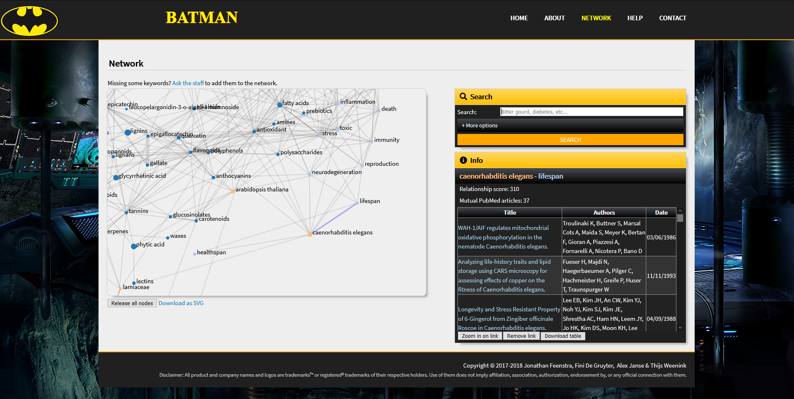

# BATMAN

Biomedical Article Text Mining ApplicatioN

Web application for visualizing the health effects of bitter gourd and yam compounds, based on our results from text mining PubMed abstracts.



[Info for our practice teacher, Thijn van Kempen](README_Thijn.md) (@ThijnsGit)

This project was graded 8.4/10.0 by the HAN University of Applied Sciences.

## Authors
### HAN BIN-2c project group 8 (course 8 2018)
* **Jonathan Feenstra** - Project leader, software engineer, database designer &amp; web developer - [JonathanFeenstra](https://github.com/JonathanFeenstra)
* **Fini De Gruyter** - Biologist &amp; text mining specialist - [FiniDG-HAN](https://github.com/FiniDG-HAN)
* **Alex Janse** - Software designer &amp; database administrator - [grimcode](https://github.com/grimcode)
* **Thijs Weenink** - Text mining software developer - [youixentoo](https://github.com/youixentoo)

All Batman-related material is trademarked by [DC Comics](https://www.dccomics.com/copyright).

## Getting started

Run [app.py](https://github.com/JonathanFeenstra/BATMAN/blob/master/app.py)
and open [127.0.0.1:5000/](http://127.0.0.1:5000/) in your browser,
or run this project on a server.

### Prerequisites

* [Flask](http://flask.pocoo.org/) - v1.0

Install using [pip](https://pip.pypa.io/en/stable/quickstart/):

```
pip install flask
```

## Built with

* [Atom](https://atom.io/) - IDE

## License

This project is licensed under the [MIT License](https://github.com/JonathanFeenstra/BATMAN/blob/master/LICENSE).

This does not include any content which is copyrighted by third parties.

## Acknowledgements

* Special thanks to [Traversy Media](https://www.youtube.com/channel/UC29ju8bIPH5as8OGnQzwJyA) for their tutorials on HTML, CSS and Flask.
